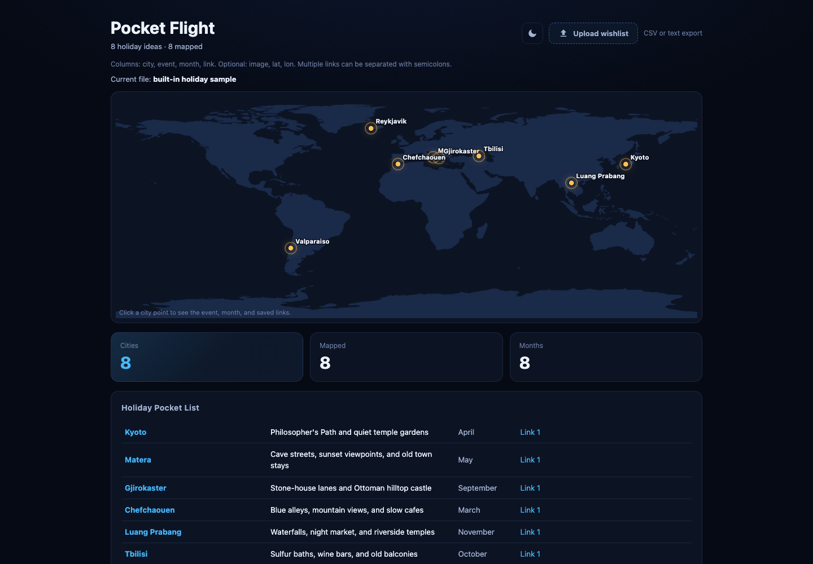

# Pocket Flight

Pocket Flight is a small static web app for planning holiday ideas on an interactive world map. It shows saved cities, trip ideas, visit months, links, preview images, and simple dashboard stats.

## Live Demo

https://patriciahuang99.github.io/pocket-flight/



## Features

- Interactive world map with clickable city pins
- Built-in sample holiday wishlist
- CSV upload for custom travel ideas
- Optional image, latitude, and longitude columns
- Dark and light theme toggle
- Responsive layout for desktop and mobile

## Run Locally

Because the app loads `world-land-110m.geojson`, run it from a local web server instead of opening `index.html` directly.

```bash
python3 -m http.server 5175
```

Then open:

```text
http://127.0.0.1:5175/index.html
```

## CSV Format

Use `holiday-wishlist-template.csv` as a starting point.

Required columns:

- `city`
- `event`
- `month`
- `link`

Optional columns:

- `image`
- `lat`
- `lon`

Multiple links can be separated with semicolons.

## Project Files

- `index.html` - main app, styles, and JavaScript
- `world-land-110m.geojson` - world map land data
- `holiday-wishlist-template.csv` - example upload file
